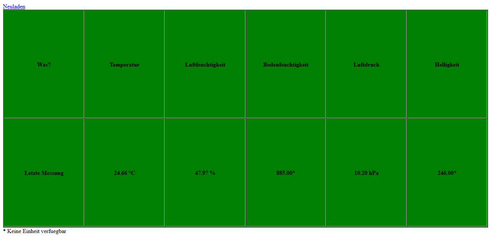

# Halbautomatische Hobbygärtnerhilfe
Eine Hilfe für Hobbygärtner, die zu wenig Zeit haben.
Diese Hilfe gießt automatisch die Pflanzen und misst Temperatur, Luftfeuchtigkeit, Luftdruck und Bodenfeuchtigkeit.
Diese Werte kann man auf der Website abrufen. Die wie folgt aussieht: 

by Niclas, Raphael und Jonas
